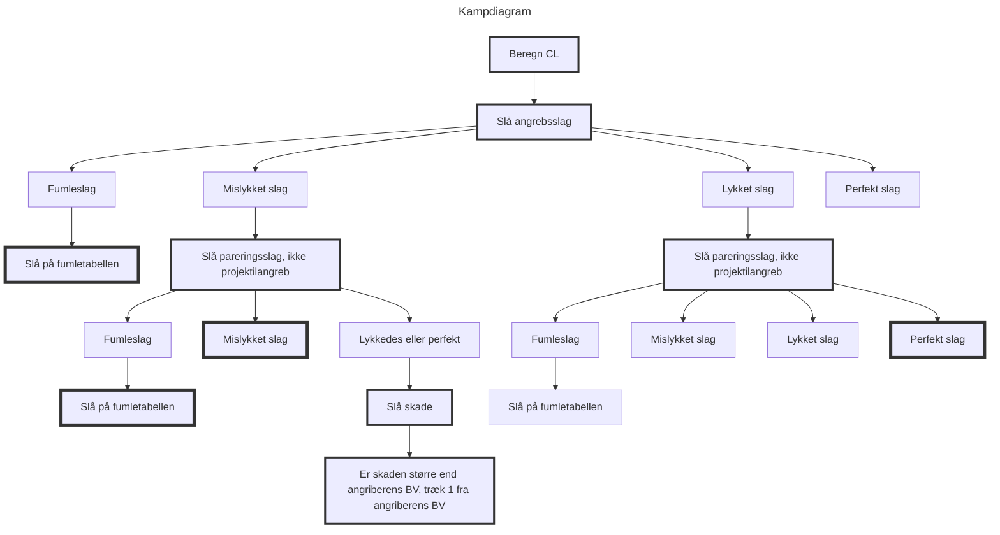

```mermaid
---
title: Kampdiagram
---
graph TD
	style id01 stroke:#333,stroke-width:3px
	style id02 stroke:#333,stroke-width:3px
	style id07 stroke:#333,stroke-width:3px
	style id08 stroke:#333,stroke-width:5px
	style id10 stroke:#333,stroke-width:5px
	style id11 stroke:#333,stroke-width:5px
	style id13 stroke:#333,stroke-width:3px
	style id14 stroke:#333,stroke-width:3px
	style id15 stroke:#333,stroke-width:3px
	style id19 stroke:#333,stroke-width:5px
	id01[Beregn CL] --> id02[Slå angrebsslag]
	id02 --> id03[Fumleslag]
	id02 --> id04[Mislykket slag]
	id02 --> id05[Lykket slag]
	id02 --> id06[Perfekt slag]
	id04 --> id07[Slå pareringsslag, ikke projektilangreb]
	id05 --> id15[Slå pareringsslag, ikke projektilangreb]
	id03 --> id08[Slå på fumletabellen]
	id07 --> id09[Fumleslag]
	id09 --> id10[Slå på fumletabellen]
	id07 --> id11[Mislykket slag]
	id07 --> id12[Lykkedes eller perfekt]
	id12 --> id13[Slå skade]
	id13 --> id14["`Er skaden større end angriberens BV, træk 1 fra angriberens BV`"]
	id15 --> id16[Fumleslag]
	id15 --> id17[Mislykket slag]
	id15 --> id18[Lykket slag]
	id15 --> id19[Perfekt slag]
	id16 --> id20[Slå på fumletabellen]
```
