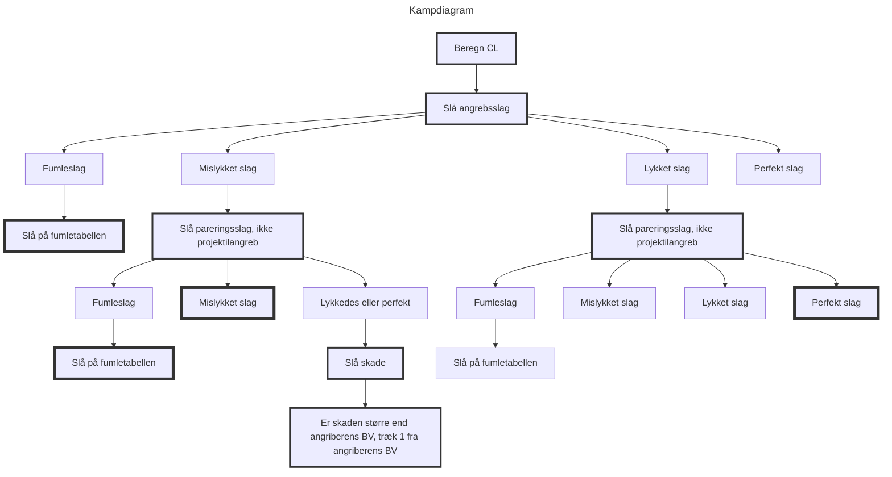

#### Tid og bevægelse
##### Stor tidsskala
Stor tidsskala bruges, når rollepersonerne ikke udfører aktiviteter, der er særligt interessante. Det involverer ofte rejser eller længere hvileperioder. I denne tid behøver SL kun at beskrive begivenheder i store træk. Hvis de rejser, kan SL for eksempel beskrive, hvordan landet eller byen ser ud generelt, hvilke byer eller landsbyer karaktererne passerer igennem osv. Man skal forvente, at der kan ske noget, og så bruger man en detaljeret tidsskala, eller evt. selv kamprunder. Om der sker noget afhænger af, om spillerne vil sætte sig selv i sådan en situation, eller at SL sætter spillerne i sådan en situation gennem for eksempel tilfældige møder.

##### Bevægelse
Over en større tidsskala er det ret almindeligt at bevæge sig længere afstande gennem landskabet. En gående rolleperson kan gå omkring 20 km om dagen uden at overanstrenge sig. Med ridedyr kan afstanden øges betydeligt. Hvor langt du kommer under forskellige omstændigheder er angivet i tabellen nedenfor. En række faktorer kan påvirke bevægelsen, både for dem der rider og for dem der går. SL bør anvende sin sunde fornuft til at modificere hvor langt rollepersonerne kan bevæge sig på en dag. Her er nogle forslag til modifikationer der kan påvirke det:
• Anvendte færdigheder: Bevægelse med ski, skøjter, ridning osv. kræver et vellykket færdighedsslag med en passende færdighed eller et SMI-slag.
• Vejr: Dårligt vejr (regn, stærk vind, kulde, varme og sne) reducerer den rejste afstand med 25 %. Dårligt vejr (f.eks. slagregn, snestorm, mudder, ørkenvarme eller dybt snedække) reducerer det med 50 %. Det rigtige udstyr modvirker nogle vejrpåvirkninger. F.eks. så er sne ingen hindring for dem der står på ski osv.
• Overlegen SMI & FYS: Karakterer, der bevæger sig til fods, kan komme længere, hvis de har en usædvanlig høj FYS og/eller SMI. Den modsvarende byrde gælder for dem, der har lave værdier i disse egenskaber. En dagsmarch bør dog ikke ændres mere end ± 5 km.

| Bevægelse      | Strækning         | Kontrolslag+                    |
| -------------- | ----------------- | ------------------------------- |
| Gang           | 20km pr. 12 timer | Intet                           |
| March          | 30km pr. 12 timer | Et let SMI-slag pr. dag         |
| Løb            | 20km pr. 6 timer  | Et let SMI-slag pr. time++      |
| Ride           | 25km pr. 12 timer | Et Ride-slag med +10 CL pr. dag |
| Hård ridt      | 40km pr. 12 timer | Et Ride-slag pr. dag            |
| Fuld firspring | 30km pr. 6 timer  | Et Ride-slag pr. time           |
\+: Hvis et færdighedsslag mislykkes, betyder det et mindre uheld, f.eks. at nogen træder skævt og forstuver foden eller at hesten glider og rollepersonen falder af.
\++: Maksimalt FYS km pr. dag. Ikke mere oppakning end STY kg. Der kræves passende påklædning.

##### Detaljeret tidsskala
Nogle gange opstår der situationer, hvor det er vigtigt at vide i detaljer, hvad der sker, time for time, minut for minut, KR for KR... Der kan det også være relevant at vide, hvor langt en person kan bevæge sig på et minut.

| Bevægelse | Strækning | Kontrolslag+             |
| --------- | --------- | ------------------------ |
| Krybe     | 20m       | -                        |
| Snige     | 50m       | Snige Sig færdighedsslag |
| Gang      | 100m      | -                        |
| Løb       | 200m      | -                        |
| Springe   | 300m      | Let SMI-slag++           |
| Sprinte   | 400m      | Let SMI-slag+++          |
\+: Hvis et færdighedsslag mislykkes, betyder det et mindre uheld, f.eks. at nogen snubler eller træder skævt og forstuver foden.
\++: Maksimalt FYS/2 minutter. Ingen rustning eller oppakning.
\+++: Maksimalt FYS/4 minutter. Der kræves passende påklædning. Ingen rustning eller oppakning.

Når man bruger detaljeret tidsskala er der god grund til at tro, at der sker noget. Det kan for eksempel være, når rollepersonerne sniger sig forbi en vagtpost og ind i en troldehule for at stjæle deres skatte. SL slår for om rollepersonerne bliver opdaget og sker det overgår man til de spændingsfyldte kamprunder (KR).

### Kamp
Da Drager og Dæmoner foregår i en primitiv verden, hvor farerne er mange, bliver det nogle gange nødvendigt for rollepersonerne at kæmpe for deres liv. Disse situationer er normalt de mest spændende, og derfor er reglerne for kamp også særligt præcise. I kamp er det især godt at gøre brug af detaljerede kort og figurer. Disse er ikke nødvendige - man kan sagtens udføre en kamp uden nogen hjælpemidler overhovedet - men det gør det lettere at overskue det hele og misforståelser undgåes.

#### Almindelig og detaljeret kamp
Nedenfor beskrives to forskellige kampsystemer, et almindeligt og et detaljeret. Det almindelige anvendes til kamp mod monstre, dyr og andre ikke-humanoide væsner, mens det detaljerede kan anvendes ved kamp mod andre personer. De detaljerede kamp-regler indeholder flere skridt så det kan være bedre at anvende almindelig kamp hvis der er mange deltagere.

#### Kamprunden
En kamp er et virvar af begivenheder, hvor der kræves hurtige beslutninger, og ingen har fuld kontrol over, hvad der sker. For at bringe orden i dette kaos må man regulere hændelsesforløbet. Under en kamp opdeles tiden i enheder på cirka fem sekunder. En sådan enhed kaldes en kamprunde (herefter forkortet KR). Under en KR kan de kæmpende udføre forskellige handlinger i en fast initiativrækkefølge. Bruger du oversigtskort, er den opdelt i kvadrater. Hvert felt er en firkant med en side på 150 cm. For de forskellige væsner er evnen til at bevæge sig angivet i antallet af felter per KR Bevægelsen er tilpasset kampsituationer, hvor man skal bevæge sig forsigtigt og være opmærksom i alle retninger. En uforstyrret person på jævnt underlag kan løbe dobbelt så langt, men i så fald må du ikke lave andet i kamprunden, end ikke kommunikere, så du er fuldstændig uvidende om dine omgivelser. En person, der hverken bærer rustning, oppakning eller har noget i hænderne og er iført passende påklædning (SL's vurdering) kan løbe med op til tre gange sin flytteformåen. Det samme gælder hvis man hopper eller springer.

##### Initiativrækkefølge
Først i kamprunden skal alle kæmpende slå et initiativslag 1T10+SMI (plus eventuelle andre modifikationer). Dem som får et højt resultat, kan gøre noget før dem, der får et lavt resultat. På den måde arrangeres alle deltagere i initiativrækkefølgen. Hvis to deltagere får det samme resultat, skal de slå om for at bestemme hvor de er indbyrdes. Initiativrækkefølgen er den samme gennem hele kampen. SL slår skjult for spillelederpersonerne.

##### Handlinger
I en KR kan du udføre en af ​​en række handlinger, som er beskrevet nedenfor. SL skal til enhver tid være styret af sund fornuft, når han overvåger kampen. Reglerne kan ikke dække alle tænkelige hændelser og SL skal derfor være parat til at træffe sine egne beslutninger om præcist hvad der sker og præcis hvor godt og hurtigt man kan udføre en bestemt handling. Spillelederen bestemmer, hvad spillelederpersonerne skal gøre, helst uden at blive påvirket af, hvad spillerne gør.

Du kan vælge at gøre følgende:

###### Kaste en besværgelse
Under denne handling koncentrerer du dig og kan ikke gøre andet i hele kamprunden. Se yderligere under overskriften 'At kaste en besværgelse' i kapitlet om magi.

###### Bevæge dig
Du kan flytte så mange felter, som din flytteformåen tillader. Mobiliteten kan nedsættes, f.eks. af vanskeligt terræn. For eksempel får en person, der vader i en sump eller går op ad en stejl skråning, sin fulde flytteformåen nedsat, men det er SL, der afgør hvor meget den reduceres. Hvis du bevæger dig det maksimale af din flytteformåen, løber du og kan ikke lave andet i den kamprunde. Du kan dog stoppe for f.eks. at søge dækning eller parere et slag. Du bliver så hvor du var, da du stoppede med at bevæge dig (SL's vurdering).

###### Affyre et projektilvåben
Du skal stå stille, sigte og affyre dit projektilvåben. Du kan ikke gøre andet i kamprunden, undtagen genlade (Se afsnittet om at genlade våben)

###### Kaste et kastevåben
Du står stille, sigter og kaster dit kastevåben. Du må ikke lave andet i kamprunden.

###### Bruge en anden færdighed
Du kan hoppe, klatre, snige, dirke en lås op og mange andre ting, der kræver et færdighedsslag. Mange færdigheder kræver fuld koncentration, så du kan ikke lave andet under kamprunden. SL kan dog ændre dette afhængig af situationen. Efter at have hoppet ned fra en trægren eller sneget sig op bag en fjende, er det f.eks. rimeligt, at du kan lave et nærkampangreb, ​​forudsat at du har et våben i hånden. Et forslag til ændring er-1 på CL. Hvis du derimod skal op på en hest, tager dette hele kamprunden. Husk at det altid er SL der bestemmer ændringerne.

###### Deltage i nærkamp
Du må ikke flytte mere end halvdelen af ​​din ændrede flytteformåen før kamp (rund ned). Se nærmere under overskriften 'Angreb og parering' nedenfor.

###### Udføre en anden handling
Under en kamp er der masser af ting, en deltager kan gøre, men som ikke er dækket af ovenstående liste. Du vil måske skifte våben, samle noget op fra jorden, sige noget eller rode i din rygsæk. SL bestemmer, hvor lang tid din handling tager, og hvilke konsekvenser det har. Disse handlinger kræver ofte ikke et færdighedsslag, men i stressede situationer, hvor der er risiko for fejl, skal der stadig slås et færdighedsslag. For at f.eks. springe op på en hest, bruger du Ride, for at genlade en armbrøst bruger du færdigheden Armbrøst osv. Fejler du, betyder det at du skal prøve igen næste runde; fumler du betyder det at du falder af din hest igen eller at du ved et uheld skærer buestrengen over med pilespidsen osv. Hvis du vil kommunikere noget til dine kammerater under kampen, kan du højst flytte halvdelen af ​​din flytteformåen (rund ned). Korte råb som *"Hjælp"* eller *"Fremad!"* tæller ikke, men kan siges når som helst i kamprunden. Længere sætninger, så som *"Ikateratera - vi skal ud herfra! Snart vil de tre mørke magikere udløse vulkanudbruddet, og så vil jætterne dukke op fra passagen til højre!"* i kamp kræver koncentration, og når sådan en handling udføres kan man kun parere i den kamprunde.

#### Angreb og parering
Der findes to slags kamp; nærkamp, ​​hvor man angriber med håndvåben og naturvåben; og afstandskamp, ​​hvor man angriber med kastevåben (kasteknive, kasteøkser osv.) eller projektilvåben (bue, armbrøst, pusterør, arbalest, bola, slynge osv.). Begge følger de samme grundlæggende principper, men projektilvåbenangreb kan ikke pareres. I nogle tilfælde får målet for angrebet lov til at afbryde, hvad han laver for at søge dækning. Normalt kan du under en KR kun lave et angreb eller en parering med et våben. Hvis du har et våben og et skjold, kan du angribe med våbnet og parere med
skjoldet, eller parere med begge. Hvis du har et våben i hver hånd, kan du lave to angreb eller to pareringer eller et angreb og en parering. Hvis nogen kan lave flere angreb, så laver alle deres første angreb først (Efter initiativrækkefølgen), derefter dem, der kan lave et andet angreb (i initiativrækkefølgen) og så videre.

##### Nærkamp
I nærkamp laver du et færdighedsslag for dine våbenfærdigheder, og hvis det lykkes rammer du din modstander. Forsvareren kan forsøge at beskytte sig selv med en parering, forudsat at han har et våben eller skjold at parere med. Dette gøres gennem et færdighedsslag. Normalt skal din modstander være på feltet ved siden af ​​dig, for at du kan lave et nærkampsangreb. Med nogle våben, f.eks. spyd og hellebarder, kan du dog angribe modstandere, der er et eller flere felter væk. Med disse våben kan du derfor angribe gennem felter med andre kæmpende i.

##### Afstandskamp
I afstandskamp laver du et færdighedsslag for dine våbenfærdigheder, og hvis det lykkes, rammer du målet. Projektilvåben (bue, armbrøst, pusterør, arbalest, bola, slynge osv.) kan ikke pareres (se dog punktet Søge dækning nedenfor). Kastevåben (kasteknive, kasteøkser osv.) kan pareres, hvis forsvareren har et skjold og ser våbnet blive kastet. Der skal være mindst et felt mellem dig og din modstander, for at du kan skyde eller kaste efter ham. Du kan ikke skyde eller kaste igennem et felt, hvor der er andre mennesker uden at risikere at ramme dem. SL bestemmer, hvor stor denne chance er, afhængig af situationen. En vejledende værdi er 50%.

##### Søge dækning
Hvis en person har mistanke om, at han vil blive beskudt med et projektilvåben, og i henhold til initiativrækkefølgen kan reagere før skytten, kan han vælge at søge dækning (f.eks. bag et træ, en sten, et hjørne eller et bord). Hvis der ikke er noget at søge dækning bag, kan han i stedet kaste sig på jorden. En sådan handling finder så sted umiddelbart før angrebet, og den dækningssøgende må ikke foretage sig andet i kamprunden. Hvis han allerede har gjort noget, beslutter SL, om han har tid til at søge dækning. Enhver, der søger dækning eller kaster på jorden, skal slå et normalt SMI-slag. Hvis det lykkes ham at søge dækning, kan han trække differenceværdien fra skyttens CL. Den, der lykkes med at kaste sig på jorden, kan trække -1 fra for hvert felt, der er mellem bueskytten og ham. Hvis slaget mislykkes, fjernes intet. Uanset udfaldet af SMI-slaget, skal skytten foretage sit angreb (medmindre han selv søger dækning for en anden skytte).

#### Kampens forløb
 I kampdiagrammet kan du se, hvilke elementer der indgår, og i hvilken rækkefølge de kommer. Teksten i en tynd ramme angiver et terningresultat eller resultatet af en beregning, og viser hvilken vej man skal gå videre. Teksten i en halvfed ramme viser, at du skal kaste en terning eller lave en beregning og derefter fortsætte lige ned. Ender du i en fed ramme, betyder det, at angrebet er overstået, og at du skal fortsætte med den næste.

##### Beregne CL
Modifikationer for afstandsangreb.

| Situation                             | Modifikation                           |
| ------------------------------------- | -------------------------------------- |
| Målet ligger ned                      | -1 for hvert felt mellem skytte og mål |
| Målet ligger stille (Bevidstløs etc.) | +10                                    |
| Skumring, fakellys                    | -5                                     |
| Mørke                                 | -15                                    |
| Sigte på bestemt kropsdel             | -5 (Kun detaljeret kamp)               |
| Vind                                  | -varierer (Se Våben og Rustninger)     |
| Afstand                               | -varierer (Se nedenfor)                |
| Skadet                                | -varierer (Se nedenfor)                |
| Målet søger dækning                   | -differenceværdien (Se ovenfor)        |
Modifikationer for nærkampsangreb.

| Situation                             | Modifikation             |
| ------------------------------------- | ------------------------ |
| Målet ligger ned                      | +5                       |
| Angreb fra siden                      | +3                       |
| Angreb bagfra                         | +7                       |
| Målet ligger stille (Bevidstløs etc.) | +10                      |
| Skumring, Fakellys                    | -5                       |
| Mørke                                 | -15                      |
| Sigte på bestemt kropsdel             | -5 (Kun detaljeret kamp) |
| Angreb med skjoldhånden               | -10                      |
| Skadet                                | -varierer (Se nedenfor)  |

##### Slå angrebsslag
Afhængigt af resultatet af angrebsslaget kan der ske tre forskellige ting. Hvis slaget er perfekt, giver angrebet automatisk maksimal skade uden mulighed for at fratrække absorberingsevnen for forsvarerens rustning eller naturlige beskyttelse. Hvis angriberen fumler, skal der i stedet for slås på en af fumletabellerne. Hvis angrebet derimod lykkes eller mislykkes, skal modstanderen lave en parering (gælder ikke almindelig kamp eller angreb med projektilvåben).

##### Slå pareringsslag
Man slår ikke pareringsslag mod projektilvåbenangreb, eller hvis forsvareren på anden måde ikke er i stand til at parere. I så fald fortsætter man som hvis pareringsslaget var mislykkedes. Du kan aldrig parere, hvis du har et afstandsvåben i hånden.

Hvordan man læser resultatet

| Angrebsslag | Pareringsslag          | Resultat                                                                                                                                          |
| ----------- | ---------------------- | ------------------------------------------------------------------------------------------------------------------------------------------------- |
| Fumlet      | Slåes ikke             | Slå på korrekt fumletabel.                                                                                                                        |
| Mislykkedes | Fumlet                 | Slå på fumletabellen for pareringer.                                                                                                              |
| Mislykkedes | Mislykkedes            | Der sker intet. Fortsæt med næste angreb.                                                                                                         |
| Mislykkedes | Lykkedes eller perfekt | Slå normal skade. Er skaden højere end angriberens våbens BV, så sænkes BV med 1.                                                                 |
| Lykkedes    | Fumlet                 | Slå på fumletabellen for pareringer og bestem derefter træfområde.                                                                                |
| Lykkedes    | Mislykkedes            | Bestem træfområde.                                                                                                                                |
| Lykkedes    | Lykkedes               | Slå normal skade. Er skaden højere end forsvarerens våben/skjolds BV, så sænkes BV med 1. Bliver BV 0, så tager forsvaren den overskydende skade. |
| Lykkedes    | Perfekt                | Der sker intet.                                                                                                                                   |
| Perfekt     | Slåes ikke             | Bestem træfområde. Angrebet gør automatisk maksimal skade. Absorberingsevnen for forsvarerens rustning trækkes ikke fra.                          |
##### Bestem træfområde

